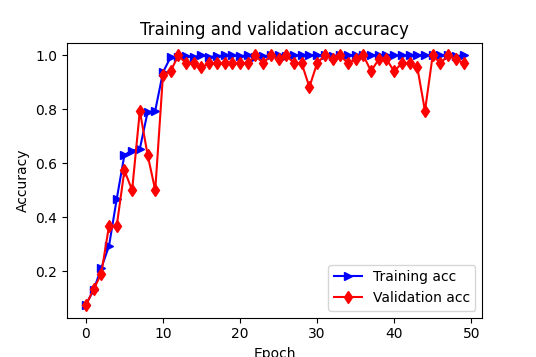
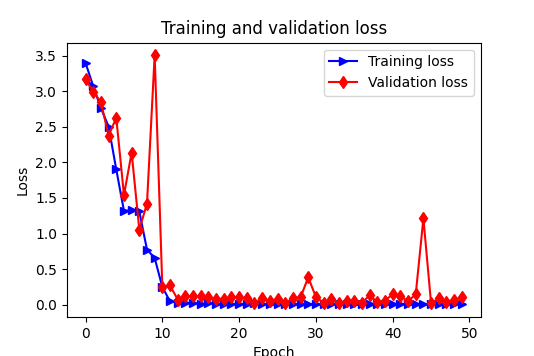

# PVCD-Pytorch
This repo includes the implementations of the Neural Networks for partial video copy detection. 

# UCF5- Dataset (inital test)

## Extract frames

The frames of all videos are extracted by using FFmpeg library. Thus, a video contains 'num_frames' / 'total_frames'.

## Create dataset

The protocol to generate the input for CNN

A video -> total_frames -> num_segments -> d_frames -> k * d_frames, where d_frames means the frame pairs such as 2-frames, 3-frames.
K stands for the number of subsamples of d_frames.

For example: a VideoRecord = [image_list_path, total_frames, classIDx] e.g., [v_CricketShot_g08_c01, 75, 0]
The 'v_CricketShot_g08_c01' has a total of 75 frames. After that, we select 'num_segments' = 30 for generating the number of segments.
From 30 frames, we then generate a combination of d-frames (e.g., 2_frames, 3_frames) like (0, 1), (0, 2) (0,3) ...
The total number of the combination of 2_frames is 30! / 2! / (30-2)!). However, we only select k subsamples over the overall combinations for
efficient training. These steps are repeated for the other d_frames.

The input of the CNN is formated [5, 8, 3, 224, 224] where batch_size = 5, num_segments = 8, num_channels = 3, width = height = 224.
The k * d_frames is then generated by TRN Module.

# VCDB - Dataset

[1] https://fvl.fudan.edu.cn/dataset/vcdb/list.htm 

This original dataset [1] contains 528 videos included 28 classes. For each video, we have used a GUI software to cut short video segments (e.g., 2-4 seconds) that served as positive videos for training. However, there are some videos containing different visual content within the same class. Thus, we have removed those inconsistent videos and obtained 454 short videos of 28 classes.

### Dataset preparation

From those videos (i.e., 454 videos), we splitted them into three parts for training, validation and testing. In particular, we used 70% of the data for training. For remaining (30%) data, we divided equally them into two parts containing 50% of the total in 30%. More precise, the total numbers of videos that use for training, evaluation and testing are 317, 68, 69, respectively. The 'prepare_vcdb_dataset.py' illustrates the pre-proccesing steps.  

## Training

We have trained the network with the following paramters:

num_segments = 30
d_frames = 8
k_random = 3
num_classes = 28
image_size = 224

batch_size = 4
num_workers = 2
learning_rate = 1e-3
momentum = 0.9
weight_decay = 5e-4
step_size = 10
num_epochs = 50
dropout = 0.6
img_feature_dim = 2048

## Result

# SVD - Dataset

[2] https://svdbase.github.io/ 

### Update git after ignoring redundant files

git rm -rf --cached .

git add .

git commit -m ".gitignore is now working"

